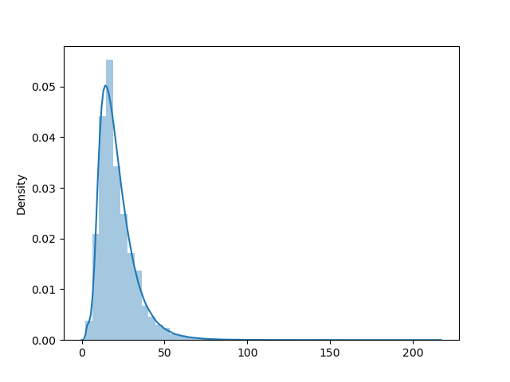

## 互联网数据挖掘——错误语句识别


### 任务要求

针对给定语句，识别该语句是否包含错误。

使用提供的数据集，基于训练集训练分类模型，并在测试集上进行性能测试


### 数据分析

训练集共590000对正错句子对，分别存储在train.cor和train.err中，逐行对应

测试集为8229个句子，格式为01标签+句子内容

对训练集中的句子进行token分析，encoding之后的向量长度分布如下图所示



根据其分布，在encoding时统一将句子padding及truncation到128


### baseline

#### 数据处理

将训练集逐个读入合并，建立对应的dataframe框架，包含note和label两列

利用transform中的BertTokenizer进行encoding，将其得到的字典一并加入dataframe框架中，代码如下

```python
# token and encoding
tokenizer = BertTokenizer.from_pretrained(config["model_name"])   
df_note = list(df["note"])
encoding = tokenizer(df_note, truncation=True, padding=True, max_length=128)

# add columns to dataframe
df["input_ids"] = encoding["input_ids"]
df["attention_mask"] = encoding["attention_mask"]
df["token_type_ids"] = encoding["token_type_ids"]
```

将生成的dataframe框架用pickle进行dump保存为二进制格式，方便后续读取

#### 模型搭建

训练基于pytorch-lightning框架，使用预训练的"Bert-base-chinese"模型，具体训练信息如下

```
model_name: "bert-base-chinese"
accelerator: ddp
train_batch_size: 64
val_batch_size: 64
n_splits: 5
num_workers: 4
gpus: 6
seed: 41
precision: 16
epochs: 20
lr: 0.00002					# get_linear_schedule_with_warmup
total_steps: 73750  		# 590000 * 2 / 5 / 64 * 20
```

optimizer采用AdamW，scheduler采用get_linear_schedule_with_warmup，loss采用CrossEntropyLoss时，score采用f1score

#### 训练结果

在训练集中表现良好，train_score可以达到0.9，在验证集表现不好，只能达到近0.5

#### 测试结果

训练时采用了五折交叉验证，故一共得到了五个模型

对五个模型的预测结果进行平均，若其值大于0.5，则认为该句子正确，否则则认为该句子错误

在测试集中表现良好，预测结果见result1.txt，各指标计算如下

```
accuracy_score: 0.727
f1_score: 0.756
```

#### 结果分析

为何在训练集上有如此好的效果，验证集却不尽如人意呢？又为何在测试集上效果还可以（显著好于验证集）呢？

私以为应该是训练时数据分布的问题，baseline的方法是直接将两个文件的句子随机打乱进行fold的划分，这就没有充分利用到正错句子之间的信息，很可能在当前fold中验证集出现的句子在训练集并没有出现过而在其他的fold中，这在一定程度上可能会造成验证集的效果下降。但在测试的时候，因为是五折的模型综合来判断，相当于做了一个ensemble，利用到了所有的训练数据信息，故最终效果要显著好于验证集


### 方法改进

将正错句子文件分别逐行插入到新文件，这样可以保证句子对相邻

在五折交叉验证时不对其进行shuffle，使同一个句子对尽量出现在同一个fold中

改进后在验证集上的f1score分数可以达到0.7+，相比于之前的0.4+具有显著提升

在测试集上同样表现良好，预测结果见result2.txt，各指标计算如下

```
accurace_score: 0.723
f1_score: 0.755
```

至于测试集为何没有显著提升，见baseline章节的结果分析。


